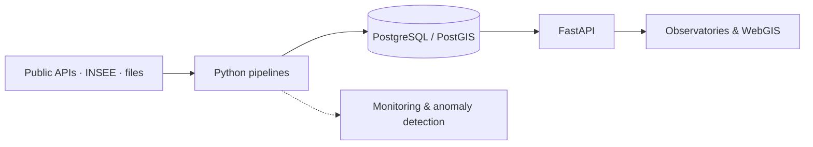

# Yanis Lepesant

**Data & Backend Engineer · Geospatial**

I build reliable data pipelines, backend services and WebGIS applications — 
from raw territorial data to production-ready tools used every day.

📍 Rennes, France 
🗣️ French (native) · English (working proficiency)

 

---

## Selected work

### Territorial data pipeline platform — AUDIAR
*Rennes urban planning agency · 2024 – present*

Migration of a legacy ETL estate to Python, with a web application to run and monitor every data flow.

- **180 Pentaho jobs → 40 Python pipelines**, orchestrated from a FastAPI + HTMX control app
- Sources: PostgreSQL/PostGIS, public APIs, national statistics files (INSEE)
- 3 environments with anomaly detection and a controlled **DEV → PROD** deployment path
- Updating a full territorial observatory now takes **one day**, fully automated

### AudioFlow — internal transcription tool — AUDIAR

Speech-to-text and meeting summaries for the agency's teams, built with **Vue 3 + FastAPI** on European models (Mistral Voxtral, Mistral Large). Presented internally to staff.

### Interactive subdivision plan — Drekky Studio *(in progress)*

WebGIS demo of an interactive housing-plot layout for a private developer: **MapLibre, PostGIS, vector tiles**.

---

## Background

- **Applications Lead**, AUDIAR (Rennes) — since Dec. 2024, previously GIS / WebGIS engineer
- **WebGIS developer**, Modaal (Lyon) — real-estate data visualization
- **Founder**, Drekky Studio — websites for craftsmen & freelance geospatial engineering
- **MSc Geomatics**, Université Rennes 2

---

## Stack

| Area | Tools |
|---|---|
| Data & Backend | Python · FastAPI · PostgreSQL / PostGIS · DuckDB · Polars · SQL |
| Geospatial | PostGIS · QGIS · MapLibre GL · vector tiles · GeoJSON |
| Frontend | Vue 3 · Nuxt · TypeScript · Vite |
| Infrastructure | Docker · Traefik · Linux (self-hosted VPS) · Git · CI/CD |

---

## How I work

- **Reliability first** — reproducible pipelines, separate environments, controlled releases
- **Data quality is a feature** — freshness checks, anomaly detection, metadata
- **Maintainable over clever** — code the next person can read, run and extend
- **Data sovereignty** — self-hosting and European providers when it makes sense

---

Python · PostgreSQL · PostGIS · FastAPI · Data Engineering · WebGIS · Geospatial

