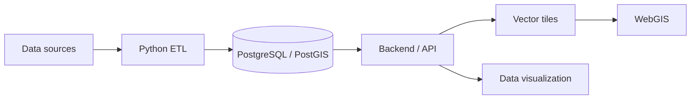

# Yanis Lepesant

### Data & Backend Engineer · Geospatial Data Specialist

 

---

## About me

I design and build **data pipelines, backend services and geospatial applications** — from raw datasets to production-ready spatial systems.

I care about **reliability, maintainability and data quality** more than hype.

---

## Core stack

**Data & Backend**

  

**Web & Frontend**

  

**Infrastructure**

  

**Geospatial**

---

## What I build

<table>
<tr>
<td width="50%" valign="top">

### 🔄 Data pipelines

ETL and data-processing workflows with **Python, SQL and PostgreSQL/PostGIS**.

- automation & reproducibility
- data quality
- maintainability
- performance

</td>
<td width="50%" valign="top">

### ⚙️ Backend & APIs

Services that expose and process structured and spatial data.

- API design
- SQL optimization
- database architecture
- business logic & data delivery

</td>
</tr>
<tr>
<td width="50%" valign="top">

### 🗺️ WebGIS

Interactive geospatial applications with **MapLibre, vector tiles and spatial APIs**.

- dynamic maps & spatial interaction
- large datasets
- territorial analysis
- data visualization

</td>
<td width="50%" valign="top">

### 📊 Data monitoring

Tools to monitor and maintain data infrastructure.

- database dependencies
- freshness monitoring
- anomaly detection
- metadata & quality control

</td>
</tr>
</table>

---

## GitHub

<picture>
  <source media="(prefers-color-scheme: dark)" srcset="https://github-readme-stats.vercel.app/api?username=Yanis1650&show_icons=true&hide_border=true&rank_icon=github&theme=github_dark&cache_seconds=86400" />
  
</picture>
<picture>
  <source media="(prefers-color-scheme: dark)" srcset="https://github-readme-stats.vercel.app/api/top-langs/?username=Yanis1650&layout=compact&hide_border=true&theme=github_dark&cache_seconds=86400" />
  
</picture>

---

### Build data. Understand space. Ship useful systems.

<a href="https://portfolio.drekky.fr/">portfolio.drekky.fr</a>

  

Python · PostgreSQL · PostGIS · Backend · Data Engineering · WebGIS · Geospatial

